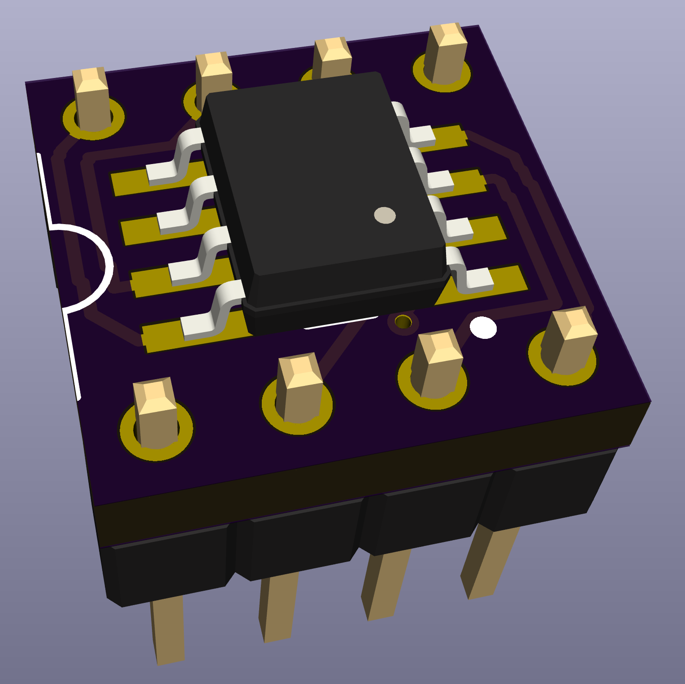

# Dipsomania through-hole adapter for SO-8 ICs and transistor arrays.

This little PCB allows use of SO-8 ICs in breadboards and in standard 0.3" row-spaced through-hole footprints as well as some IC sockets (probably not the fancypants machined pin socket types though).

<b>v0.11 (first source publication):</b> 

Here we go!
