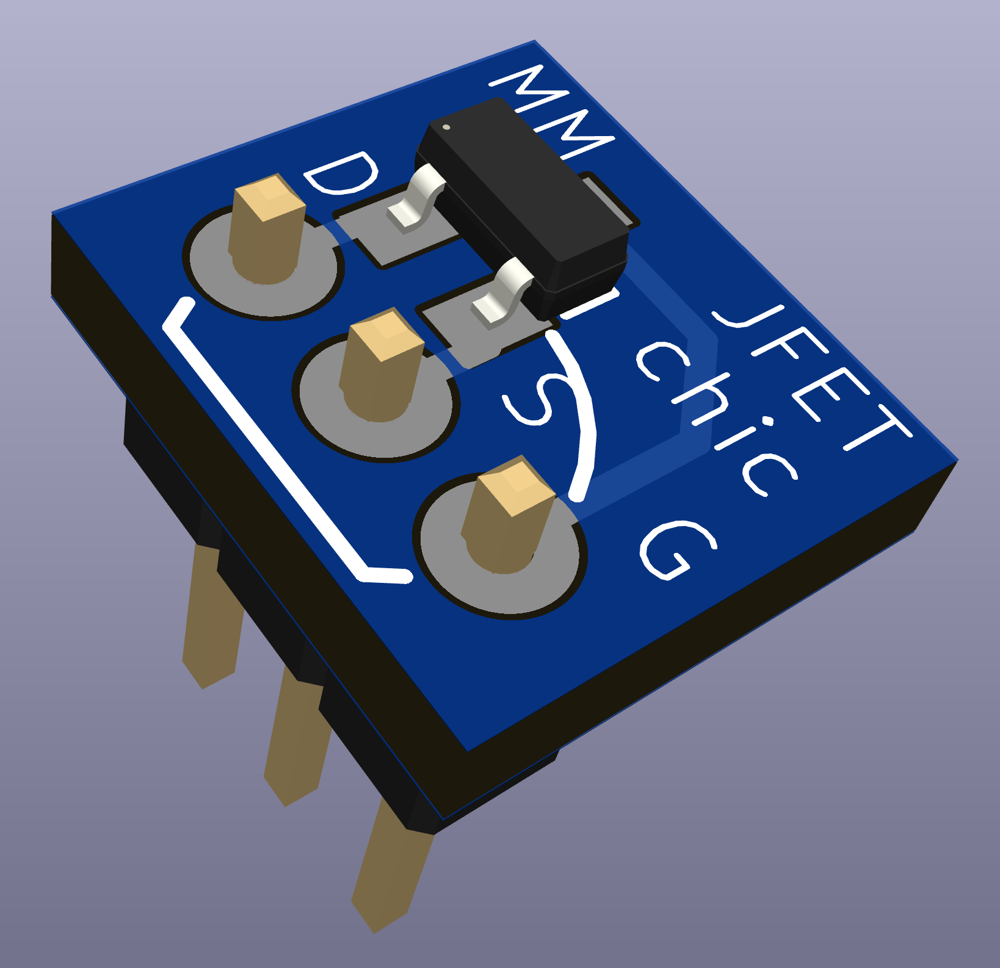

# JFETchic through-hole adapter for SOT23-3 JFETS and some bipolar transistors.

Now that through-hole JFETs are an endangered species, this tiny PCB allows using SOT23-3 JFETs in breadboards and PC boards laid out for their TO-92 equivalents. Check pinouts before using for bipolar transistors, some may not be compatible. Also, the pin header is only shown for conceptual illustration in the render-I recommend using component lead clippings as square pin headers may not fit in TO92 PC board footprints, and square pin headers will not fit the JFETchic.

<b>v0.11 (first source publication):</b> 

Here we go!
