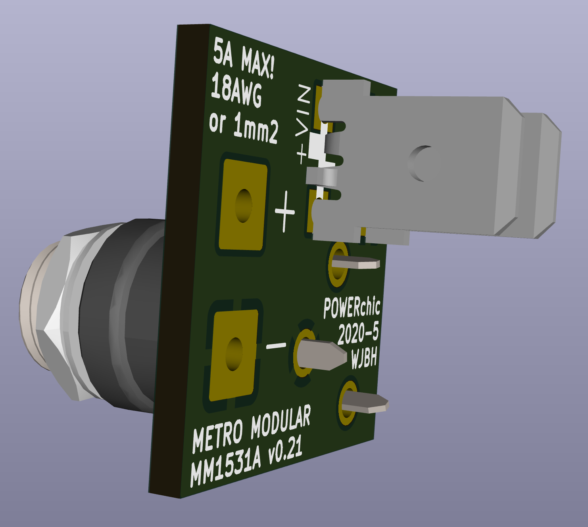

# POWERchic through-hole panel-mount barrel power jack flying lead adapter.

This little PCB allows using through-hole Switchcraft-style 5.5mm barrel power connectors (712A or 722A) with flying 18AWG wires or faston spade lugs (TE 63824-1 or equivalent). It has been designed to ensure there is at least 112 mils of of conductor at any point on the board so even with basic 1oz copper it will be able to handle 5 amps safely.

<b>v0.21 (first source publication):</b> 
